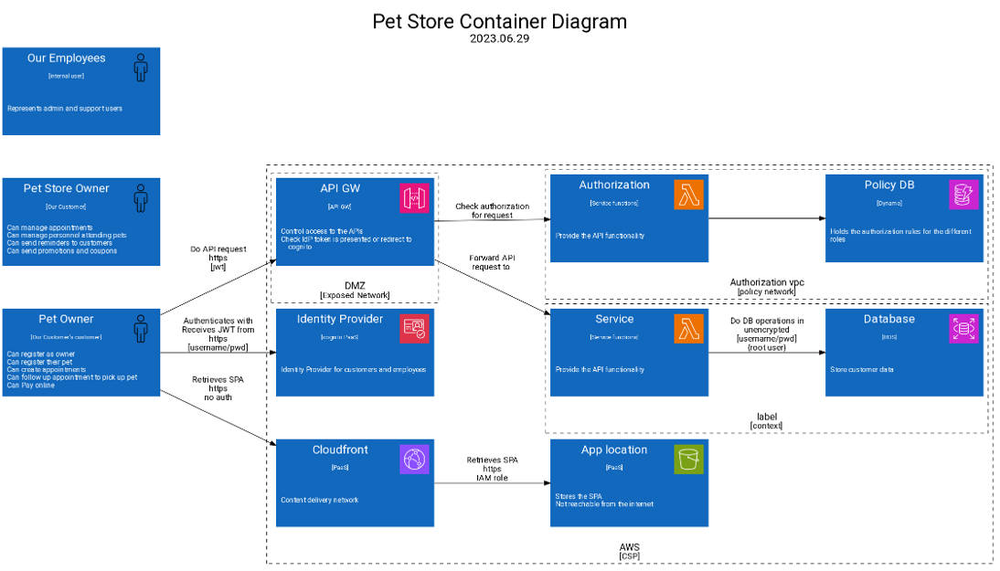

# Target of Evaluation

Startup selling SaaS marketplace solution to Pet Stores to optimize their processes and keep their online presence as well as Pet Owners to find services for their dear ones.

## Use Cases

### Pet Shop Owner

* Register their shop at superPets.com
* Get a subdomain as: theirShop.superPets.com
* Customize “their” shop
* Announce their services and specialties
* Can use the platform’s payment provider
* Can manage their employees and appointments
* Can send coupons, promotions, and reminders to their customers
* Can respond to reviews

### Pet Owner

* Can sign up with superpets.com
* Can pick a pet store from their area
* Can register a pet (type, name, breed, age)
* Can manage appointments
* Can leave reviews for a pet shop
* Can pay online

## Architecture

### Context Diagram

### Areas of concern (Excercise 1)

1. start here
1. continue here

### Container Diagram

## Threat Model

* Exercise 2: identify vulnerabilities. Help yourself with these sources: [cwes](./cwes.md) and [security principles](./securityPrinciples.md)
* Exercise3: Create Credible attack vectors. You can inspire yourself with this resource [elevation of privilege](./stride.md)

|Id| Title| Vulnerability | Attack scenario | Outcome|Severity|Countermeasure|
|--|--|--|--|--|--|--|
|1| name me | Briefly describe the vulnerability | Given the vulnerability, WHEN bad thing happens, THEN this is the consequence| Rate me (low, medium, high, critical) | What can we do about it|
