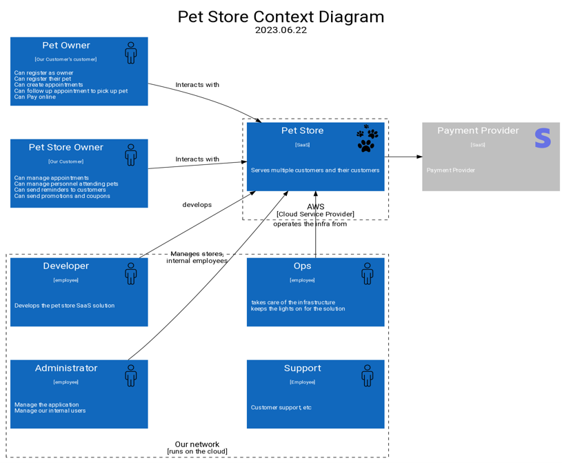

# Target of Evaluation

Startup selling SaaS marketplace solution to Pet Stores to optimize their processes and keep their online presence as well as Pet Owners to find services for their dear ones.

## Architecture

### Context Diagram

### Areas of concern

1. start here
1. continue here

### Container Diagram

## Threat Model

|Id| Title| Vulnerability | Attack scenario | Outcome|Severity|
|--|--|--|--|--|--|
|1| name me | Briefly describe the vulnerability | Given the vulnerability, WHEN bad thing happens, THEN this is the consequence| Rate me (low, medium, high, critical) | What can we do about it|
